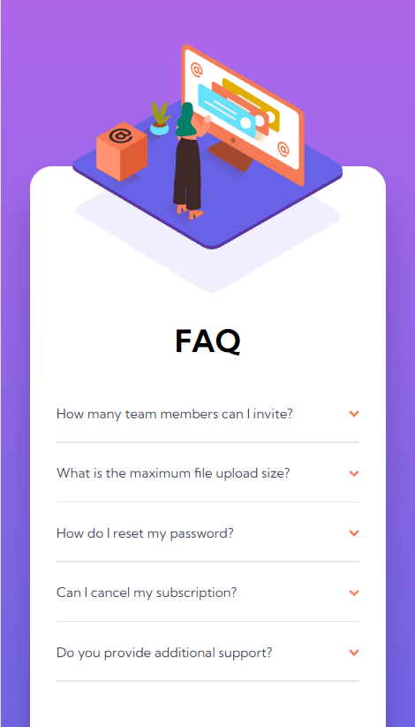

# Frontend Mentor - FAQ accordion card solution

This is a solution to the [FAQ accordion card challenge on Frontend Mentor](https://www.frontendmentor.io/challenges/faq-accordion-card-XlyjD0Oam). Frontend Mentor challenges help you improve your coding skills by building realistic projects.

## Table of contents

- [Overview](#overview)
  - [The challenge](#the-challenge)
  - [Screenshots](#screenshots)
  - [Links](#links)
- [My process](#my-process)
  - [Built with](#built-with)
  - [What I learned](#what-i-learned)
- [Author](#author)

## Overview

### The challenge

Users should be able to:

- View the optimal layout for the component depending on their device's screen size
- See hover states for all interactive elements on the page
- Hide/Show the answer to a question when the question is clicked

### Screenshot

### Links

- [Frontend Mentor solution](https://www.frontendmentor.io/solutions/responsive-accordion-card-with-element-instead-of-js-l4U2LO5fkq)
- [GitHub repo](https://github.com/RoksolanaVeres/Faq_accordion_card)
- [Live Site](https://roksolanaveres.github.io/Faq_accordion_card/)

## My process

### Built with

- Semantic HTML5 markup
- BEM naming approach
- Grid
- Mobile-first workflow

### What I learned

- Learned how to make accordion without JS
- Honed my positioning skills
- Practiced to use variables in CSS for colors

## Author

- Frontend Mentor - [@RoksolanaVeres](https://www.frontendmentor.io/profile/RoksolanaVeres)
